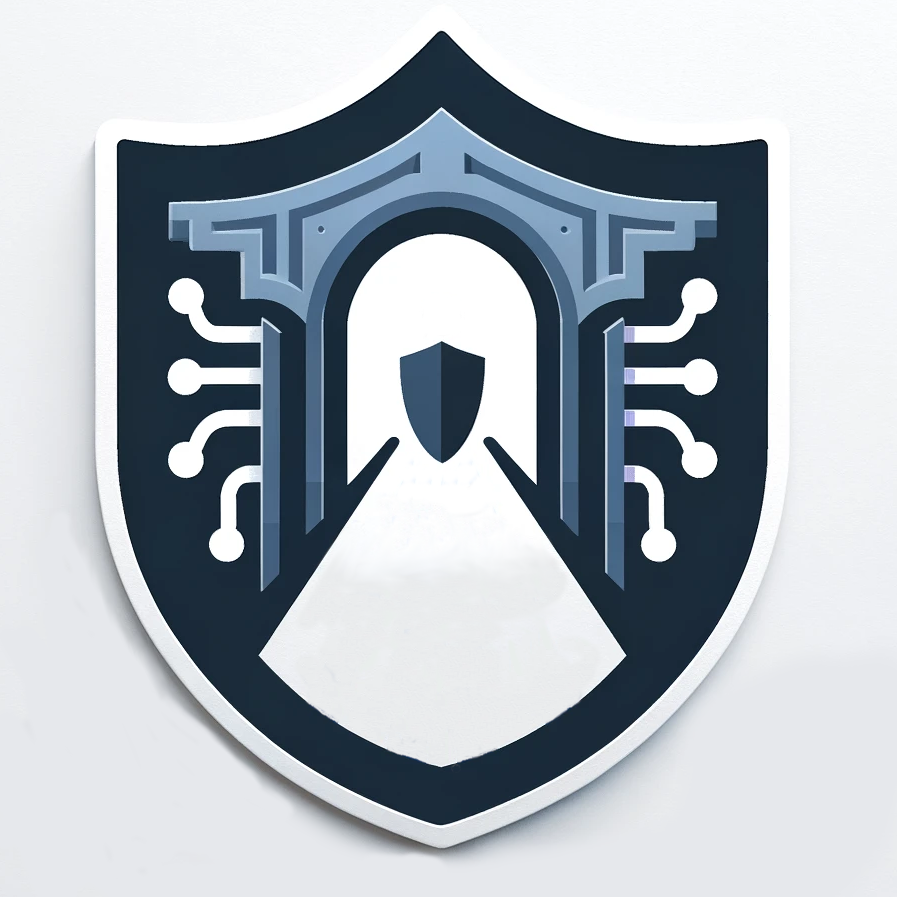
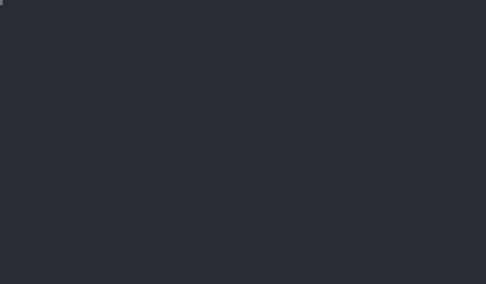

<a name="readme-top"></a>


<!-- PROJECT SHIELDS -->
<!--
*** I'm using markdown "reference style" links for readability.
*** Reference links are enclosed in brackets [ ] instead of parentheses ( ).
*** See the bottom of this document for the declaration of the reference variables
*** for contributors-url, forks-url, etc. This is an optional, concise syntax you may use.
*** https://www.markdownguide.org/basic-syntax/#reference-style-links
-->
[![Contributors][contributors-shield]][contributors-url]
[![Forks][forks-shield]][forks-url]
[![Stargazers][stars-shield]][stars-url]
[![Issues][issues-shield]][issues-url]
[![MIT License][license-shield]][license-url]

<!-- PROJECT LOGO -->
<br />
<div align="center">
  

  <h3 align="center">Oathgate</h3>

  <p align="center">
    A userspace networking stack for virtual machines
    <br />
    <a href="https://github.com/kvnallsn/oathgate/issues/new?labels=bug">Report Bug</a>
    ·
    <a href="https://github.com/kvnallsn/oathgate/issues/new?labels=enhancement">Request Feature</a>
  </p>
</div>


<!-- TABLE OF CONTENTS -->
<details>
  <summary>Table of Contents</summary>
  <ol>
    <li>
      <a href="#about-the-project">About The Project</a>
      <ul>
        <li><a href="#built-with">Built With</a></li>
      </ul>
    </li>
    <li>
      <a href="#getting-started">Getting Started</a>
      <ul>
        <li><a href="#prerequisites">Prerequisites</a></li>
        <li><a href="#installation">Installation</a></li>
      </ul>
    </li>
    <li><a href="#usage">Usage</a></li>
    <li><a href="#roadmap">Roadmap</a></li>
    <li><a href="#contributing">Contributing</a></li>
    <li><a href="#license">License</a></li>
  </ol>
</details>


<!-- ABOUT THE PROJECT -->
## About The Project
Oathgate is a userspace networking stack with support for Qemu virtual machines via the vhost-user protocol.  It includes a layer 2 switch and layer 3 IP router and supports various WAN connection types. It supports logging traffic, encrypted WAN connections, and includes a basic DHCPv4 server to simplify virtual machine setup.



<p align="right">(<a href="#readme-top">back to top</a>)</p>


### Built With

* [![Rust][rust-shield]][rust-url]

<p align="right">(<a href="#readme-top">back to top</a>)</p>


<!-- GETTING STARTED -->
## Getting Started

If you plan to build from source, Oathgate is built using Rust. See the prerequisites section for how to install it before continuing.

### Prerequisites

* Rust / Cargo
  ```sh
  curl --proto '=https' --tlsv1.2 -sSf https://sh.rustup.rs | sh
  ```

### Installation

1. Clone the repo
   ```sh
   git clone https://github.com/kvnallsn/oathgate.git
   ```
2. Build the executables
   ```sh
   cargo build --release
   ```

The 

<p align="right">(<a href="#readme-top">back to top</a>)</p>


<!-- USAGE EXAMPLES -->
## Usage

There are two primary executables need to run an Oathgate virtual machine:
* `oathgate-bridge` - The L2/L3 networking stack for virtual machines
* `oathgate-runner` - Virtual machine (Qemu) runner, provides a psuedo-terminal for access

1. Create a userspace network bridge (using the default socket address `/tmp/oathgate.sock`)
   ```sh
   oathgate-bridge -v config.yml
   ```

2. Start a virtual machine running on the network bridge
   ```sh
   oathgate-runner machine.yml
   ```

### Bridge Configuration

`oathgate-bridge` is configured using a YAML file to specify the bridge's settings (such as router subnet and DHCP).

The bridge supports an optional WAN configuration that will use to forward all non-local traffic (aka traffic not destined for other devices in the subnet).  The following WAN providers exist or under development:
| Type       | Config Key | Description                                                       |
| ---------- | ---------- | ----------------------------------------------------------------- |
| WireGuard  | wireguard  | Encrypts and forwards traffic to the specified WireGuard endpoint |
| UDP        | udp        | Forwards all traffic to the specified UDP endpoint                |
| TAP Device | tap        | Exposes traffic to host device/network (_under development_)      |

Below is a sample configuration for a router serving the `10.67.213.0/24` subnet that will forward all non-local traffic to a WireGuard endpoint (the WAN connection).  Additionally, it will start a DHCPv4 server that will lease addresses between `10.67.213.100` and `10.67.213.200`.

```yaml
wan:
    type: wireguard
    key: ---secret key goes here---
    peer: ---peer public key here---
    endpoint: ---endpoint socket address here---
    ipv4: ---assigned ipv4 address for private key---

router:
    ipv4: 10.67.213.1/24
    dhcp:
        start: 10.67.213.100
        end: 10.67.213.200
    dns: false

virtio:
    queues: 1
```

### Machine Configuration

The machine configuration is a subset of Qemu's configuration (for now). Only a few fields are supported.

Below is a sample configuration for a Debian system installed on a qcow2 image (on partition 1) that will run the (external) Linux kernel version 6.1.

For instructions on building a Linux kernel from source, see: _insert link_
For instructions on building a disk image see: _insert link_

```yaml
machine:
    cpu: q35
    memory: 512m
    kernel: ./vmlinux-6.1
    disk: ./debian.qcow
```

<p align="right">(<a href="#readme-top">back to top</a>)</p>


<!-- ROADMAP -->
## Roadmap

- [ ] Add Changelog
- [ ] Improve Terminal (PTY) handling
- [ ] Added IPv6 Support

See the [open issues](https://github.com/kvnallsn/oathgate/issues) for a full list of proposed features (and known issues).

<p align="right">(<a href="#readme-top">back to top</a>)</p>


<!-- CONTRIBUTING -->
## Contributing

Contributions are what make the open source community such an amazing place to learn, inspire, and create. Any contributions you make are **greatly appreciated**.

If you have a suggestion that would make this better, please fork the repo and create a pull request. You can also simply open an issue with the tag "enhancement".
Don't forget to give the project a star! Thanks again!

1. Fork the Project
2. Create your Feature Branch (`git checkout -b feature/AmazingFeature`)
3. Commit your Changes (`git commit -m 'Add some AmazingFeature'`)
4. Push to the Branch (`git push origin feature/AmazingFeature`)
5. Open a Pull Request

<p align="right">(<a href="#readme-top">back to top</a>)</p>


<!-- LICENSE -->
## License

Distributed under the MIT License. See `LICENSE.txt` for more information.

<p align="right">(<a href="#readme-top">back to top</a>)</p>


<!-- MARKDOWN LINKS & IMAGES -->
<!-- https://www.markdownguide.org/basic-syntax/#reference-style-links -->
[contributors-shield]: https://img.shields.io/github/contributors/kvnallsn/oathgatestyle=for-the-badge
[contributors-url]: https://github.com/kvnallsn/oathgate/graphs/contributors
[forks-shield]: https://img.shields.io/github/forks/kvnallsn/oathgatestyle=for-the-badge
[forks-url]: https://github.com/kvnallsn/oathgate/network/members
[stars-shield]: https://img.shields.io/github/stars/kvnallsn/oathgatestyle=for-the-badge
[stars-url]: https://github.com/kvnallsn/oathgate/stargazers
[issues-shield]: https://img.shields.io/github/issues/kvnallsn/oathgate?style=for-the-badge
[issues-url]: https://github.com/kvnallsn/oathgate/issues
[license-shield]: https://img.shields.io/github/license/kvnallsn/oathgate?style=for-the-badge
[license-url]: https://github.com/kvnallsn/oathgate/blob/master/LICENSE.txt
[rust-shield]: https://img.shields.io/badge/rust-orange?style=for-the-badge&logo=rust&logoColor=white
[rust-url]: https://www.rust-lang.org/
